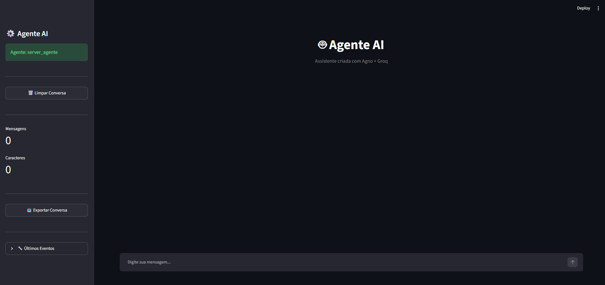

<div align="center">

# 🚀 Agente Agno

Uma plataforma modular para construção de agentes de IA utilizando Agno, Groq, FastAPI, Streamlit e ChromaDB.



</div>

---

## ✨ Features

- 🤖 Agentes conversacionais
- 🧠 Memória persistente
- 📚 RAG com documentos PDF
- ⚡ Streaming de respostas em tempo real
- 🔍 Busca semântica com ChromaDB
- 🌐 API REST com FastAPI
- 🎨 Interface web com Streamlit
- 🔌 Arquitetura modular
- 🏗️ Preparado para múltiplos agentes
- 📈 Fácil expansão para MCP, Teams e Workflows

---

# 🏛️ Arquitetura

```text
                 ┌─────────────────┐
                 │   Streamlit UI  │
                 └────────┬────────┘
                          │
                          ▼
                 ┌─────────────────┐
                 │ FastAPI + Agno  │
                 └────────┬────────┘
                          │
                          ▼
                 ┌─────────────────┐
                 │ Agent Registry  │
                 └────────┬────────┘
                          │
          ┌───────────────┼───────────────┐
          ▼                               ▼

   ┌──────────────┐              ┌──────────────┐
   │ Chat Agent   │              │  PDF Agent   │
   └──────┬───────┘              └──────┬───────┘
          │                             │
          ▼                             ▼

      SQLite                     Knowledge Base
                                       │
                                       ▼
                                  ChromaDB
                                       │
                                       ▼
                                     PDFs
```

---

# 📂 Estrutura do Projeto

```text
src/agente_agno/

├── core/
│   ├── config/
│   ├── database/
│   ├── logging/
│   └── exceptions/
│
├── agents/
│   ├── registry.py
│   │
│   ├── chat/
│   │   ├── agent.py
│   │   ├── prompts.py
│   │   └── tools.py
│   │
│   ├── pdf/
│   │   ├── agent.py
│   │   ├── prompts.py
│   │   └── tools.py
│   │
│   └── analyst/
│       ├── agent.py
│       ├── prompts.py
│       └── tools.py
│
├── knowledge/
│   ├── loaders/
│   ├── embeddings/
│   └── vector_store/
│
├── api/
│   ├── main.py
│   ├── routes/
│   └── schemas/
│
├── ui/
│   ├── pages/
│   ├── components/
│   └── streamlit_app.py
│
├── clients/
│   └── agent_client.py
│
├── scripts/
│   ├── load_pdf.py
│   └── rebuild_vector_db.py
│
├── tests/
│
├── data/
│   ├── pdfs/
│   ├── chromadb/
│   ├── sqlite/
│   └── uploads/
│
└── main.py
```

---

# 🛠️ Tecnologias

| Tecnologia | Função |
|------------|---------|
| Agno | Framework de agentes |
| Groq | Inferência LLM |
| FastAPI | API |
| Streamlit | Interface Web |
| SQLite | Memória persistente |
| ChromaDB | Banco vetorial |
| Python | Linguagem principal |

---

# ⚙️ Instalação

## Clone o projeto

```bash
git clone https://github.com/GuiMRDS/Agente_Agno.git

cd Agente_Agno
```

## Crie o ambiente virtual

```bash
python -m venv .venv
```

### Linux / Mac

```bash
source .venv/bin/activate
```

### Windows

```bash
.venv\Scripts\activate
```

## Instale as dependências

```bash
pip install -r requirements.txt
```

---

# 🔐 Variáveis de Ambiente

Crie um arquivo `.env`

```env
GROQ_API_KEY=your_api_key
```

---

# ▶️ Executando o Projeto

## Iniciar API

```bash
python -m src.agente_agno.main
```

API:

```text
http://localhost:8000
```

---

## Cliente Terminal

```bash
python src/agente_agno/clients/agent_client.py
```

---

## Interface Streamlit

```bash
streamlit run src/agente_agno/ui/streamlit_app.py
```

Aplicação:

```text
http://localhost:8501
```

---

# 🧠 Como Funciona o RAG

```text
Pergunta
    │
    ▼

Busca Vetorial
    │
    ▼

Documentos Relevantes
    │
    ▼

Contexto Recuperado
    │
    ▼

LLM (Groq)
    │
    ▼

Resposta Final
```

---

# 📚 Base de Conhecimento

Os documentos devem ser armazenados em:

```text
data/pdfs/
```

Após a indexação:

```text
PDF
 ↓
Chunking
 ↓
Embedding
 ↓
ChromaDB
```

---

# 👨‍💻 Autor

**Guilherme Marinho Rodrigues dos Santos**

Desenvolvedor Full Stack focado em:

- Inteligência Artificial
- Cloud Computing
- Backend Development
- Cybersecurity

GitHub:
https://github.com/GuiMRDS

---

# 📜 Licença

Distribuído sob a licença MIT.

⭐ Se este projeto foi útil para você, considere deixar uma estrela no repositório.